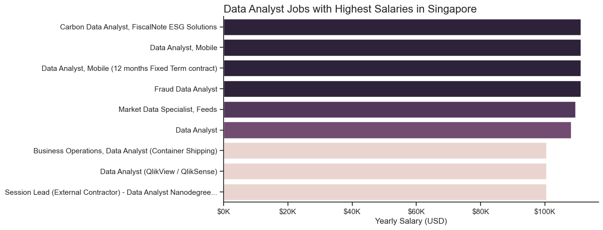
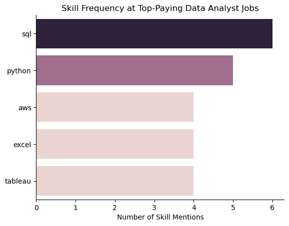

# Overview
The purpose of this project was to understand the Data Analyst job market in Singapore better, focusing on the potential salary and skills required to succeed in this role. The related queries can be found in this [folder](project_sql).
# Background
As someone looking to transition from an investment background to the data analytics field in Singapore, I took up a couse in SQL offered by Luke Barousse and modified this capstone project to suit my need better in the local context. The key questions I wanted to explore were:
1. What are the top paying data analyst jobs in Singapore?
2. What skills are required for these top-paying jobs?
3. What skills are most in demand for data analysts?
4. Which skills are associated with higher salaries?
5. What are the most optimal skills to learn?

# Tools Used
The tools I used in this project include:
- **SQL**: Using PostgreSQL as the database management system, I wrote SQL queries to retrieve information of interest from the raw dataset, leveraging advanced skills such as CTEs, aggregations, and conditions.
- **Visual Studio Code**: The code editor I use for my data analytics projects.
- **Git and GitHub**: Repositories to save my work and to enable to sharing of these works with interested parties incorporating version control.

# Analysis

### 1. Top Paying Data Analyst Jobs

In this query, I filtered the dataset for Data Analyst roles in Singapore. Initially, I identified some mislabelled roles, so I subsequently added in another exclusionary filter for these roles with erroneous titles.

I ordered the resulting roles by their salaries in descending order, and used LIMIT to obtain the top 10 results.

```sql
SELECT
    job_id,
    job_title,
    name AS company_name,
    job_location,
    job_schedule_type,
    salary_year_avg,
    job_posted_date
FROM job_postings_fact

LEFT JOIN
    company_dim ON company_dim.company_id = job_postings_fact.company_id

WHERE 
    job_title_short = 'Data Analyst' AND
    salary_year_avg IS NOT NULL AND
    job_country = 'Singapore' AND
    job_title NOT LIKE '%Research_Scientist%'

ORDER BY
    salary_year_avg DESC

LIMIT 10
```
I visualized the result set using Python's seaborn library to view it more easily.

```python
plt.figure(figsize=(10,5))
sns.barplot(df_viz, x='salary_year_avg', y='job_title', hue='salary_year_avg', legend=False)
sns.despine()
plt.ylabel('')
plt.xlabel('Yearly Salary (USD)')
plt.title('Data Analyst Jobs with Highest Salaries in Singapore', fontsize= 16, loc='left')
plt.gca().xaxis.set_major_formatter(FuncFormatter(lambda x, pos: f'${x/1000:.0f}K'))
plt.show()
```


*Bar chart visualizing the top paying data analyst jobs in Singapore.*

From this result, we can see that:
- **Specialization drives higher pay**: The top salaries are linked to roles focused on ESG, mobile analytics, and fraud, highlighting the value of domain expertise.

- **Generalist roles earn less within the top tier**: Jobs labeled simply as “Data Analyst” rank lower than specialized positions in this high-paying segment.

- **Contract and tool-specific roles may limit compensation**: External contractor roles and those focused on tools like QlikView appear at the lower end of the top salary range.

### 2. Skills Required by the Top-Paying Jobs
I continued with another query to understand the associated skills at these top-paying jobs, building upon the query in the previous step.
```sql
WITH top_paying_jobs AS (
    SELECT
        job_id,
        job_title,
        name AS company_name,
        job_location,
        salary_year_avg
    FROM job_postings_fact

    LEFT JOIN
        company_dim ON company_dim.company_id = job_postings_fact.company_id

    WHERE 
        job_title_short = 'Data Analyst' AND
        salary_year_avg IS NOT NULL AND
        job_country = 'Singapore' AND
        job_title NOT LIKE '%Research_Scientist%'

    ORDER BY
        salary_year_avg DESC

    LIMIT 10
)

SELECT
    top_paying_jobs.*,
    skills AS skill_name
FROM top_paying_jobs
INNER JOIN
    skills_job_dim AS job_skills ON job_skills.job_id = top_paying_jobs.job_id
INNER JOIN
    skills_dim ON job_skills.skill_id = skills_dim.skill_id
ORDER BY
    salary_year_avg DESC
```
Similarly, I used Python's seaborn library to visualize the result:
```python
sns.barplot(df_skill,x='skill_count', y='skill_name', hue='skill_count',legend=False)
sns.despine()
plt.ylabel('')
plt.xlabel('Number of Skill Mentions')
plt.title('Skill Frequency at Top-Paying Data Analyst Jobs')
plt.show()
```


*Bar chart visualizing the skills mentioned at top-paying data analyst jobs in Singapore.*

Just from this list of top-paying data analyst roles, we can see that:
- **SQL is the most in-demand skill**: It appears in nearly all top-paying data analyst roles, highlighting its foundational importance for data work.

- **Python stands out as a key programming skill**: Its high frequency signals strong demand for scripting, automation, and analytics beyond spreadsheets.

- **Business intelligence and cloud tools are highly valued**: Skills like AWS, Excel, and Tableau are equally mentioned, reflecting the need for both data infrastructure and visualization capabilities.

### 3. Highly Demanded Skills
I broadened my focus to include not just skills mentioned in the top-paying jobs, but the entire data analyst job market to better understand the valuable skills to acquire in order to penetrate the job market, focusing on the top 5 most demanded skills.
```sql
SELECT 
    skills,
    COUNT(job_postings_fact.job_id) AS job_count
FROM job_postings_fact
INNER JOIN
    skills_job_dim AS job_skills ON job_skills.job_id = job_postings_fact.job_id
INNER JOIN
    skills_dim ON job_skills.skill_id = skills_dim.skill_id
WHERE
    job_title_short = 'Data Analyst' AND
    job_country = 'Singapore' AND
    job_title NOT LIKE '%Research_Scientist%'
GROUP BY   
    skills
ORDER BY job_count DESC
LIMIT 5
```
| Skill   | Job Count |
|---------|-----------|
| SQL     | 3,664     |
| Python  | 3,106     |
| Excel   | 2,308     |
| Tableau | 2,216     |
| R       | 1,324     |

*Table showing number of times each skill is mentioned.*

From this result table, we learn that:
- **SQL is the most sought-after skill**: It appears in the highest number of job postings, underscoring its essential role in data access and manipulation.

- **Python is a close second in demand**: Its popularity reflects the growing emphasis on automation, scripting, and data science capabilities in analyst roles.

- **Excel, Tableau, and R remain relevant**: These tools continue to appear frequently, highlighting the importance of both traditional and modern analytics tools in the Singapore job market.

### 4. Skills Commanding the Highest Salaries
I set off to explore the skills offering the highest salaries in Singapore data analyst jobs, based on their associated job postings.
```sql
SELECT 
    skills,
    ROUND(AVG(salary_year_avg),0) AS avg_skill_salary
FROM job_postings_fact
INNER JOIN
    skills_job_dim AS job_skills ON job_skills.job_id = job_postings_fact.job_id
INNER JOIN
    skills_dim ON job_skills.skill_id = skills_dim.skill_id
WHERE
    job_title_short = 'Data Analyst' AND
    salary_year_avg IS NOT NULL AND
    job_country = 'Singapore' AND
    job_title NOT LIKE '%Research_Scientist%'
GROUP BY   
    skills
ORDER BY avg_skill_salary DESC
LIMIT 25
```
This yielded the table below:
| Skill       | Average Salary (USD) |
|-------------|----------------------|
| Looker      | $111,175             |
| Linux       | $109,500             |
| Word        | $105,838             |
| PowerPoint  | $105,838             |
| Flow        | $105,558             |
| Excel       | $100,569             |
| Pandas      | $100,500             |
| Zoom        | $100,500             |
| Slack       | $100,500             |
| Qlik        | $100,500             |
| SAS         | $100,500             |
| NumPy       | $100,500             |
| SPSS        | $99,500              |
| JavaScript  | $98,500              |
| R           | $94,676              |
| Python      | $94,525              |
| Tableau     | $92,856              |
| AWS         | $92,435              |
| SQL         | $86,853              |
| Power BI    | $84,044              |
| Hadoop      | $81,225              |
| Outlook     | $79,200              |
| Spark       | $78,088              |
| Azure       | $72,750              |
| GCP         | $72,750              |

*Table of the average salary for the top 10 paying skills for data analysts.*

We can draw the following insights from the table above:
- **Specialized tools like Looker and Linux are linked to the highest salaries**: These skills top the list, suggesting that niche or infrastructure-related expertise commands premium compensation.

- **Common productivity tools still correlate with strong pay**: Skills like Word, PowerPoint, Excel, and even Zoom and Slack appear in high-paying roles, indicating that communication and documentation remain valued.

- **Popular data skills like SQL, Python, and Tableau offer solid but not top-tier pay**: While widely required, these skills are so common that they may not differentiate candidates in terms of salary potential.

### 5. Optimal Skills to Learn

Having now insights on the skill popularity and associated salaries, I then explore the intersection of these two analyses by combining them, filtering the skills for only those with decent popularity of at least 100 mentions, then sorting them to obtain the top 25 in-demand and well-paying skills.
```sql
SELECT 
    skills,
    ROUND(AVG(salary_year_avg),0) AS avg_skill_salary,
    COUNT(job_postings_fact.job_id) AS job_count
FROM job_postings_fact
INNER JOIN
    skills_job_dim AS job_skills ON job_skills.job_id = job_postings_fact.job_id
INNER JOIN
    skills_dim ON job_skills.skill_id = skills_dim.skill_id
WHERE
    job_title_short = 'Data Analyst' AND
    salary_year_avg IS NOT NULL AND
    job_title NOT LIKE '%Research_Scientist%'
GROUP BY   
    skills
HAVING
    COUNT(job_postings_fact.job_id) > 100
ORDER BY 
    avg_skill_salary DESC,
    job_count DESC
LIMIT 25
```
Visualizing the result in tabular form:
| Skill       | Average Salary (USD) | Job Count |
|-------------|----------------------|-----------|
| Databricks  | $112,881             | 102       |
| Spark       | $112,404             | 184       |
| Snowflake   | $111,578             | 241       |
| Hadoop      | $110,888             | 140       |
| NoSQL       | $108,331             | 108       |
| Jira        | $107,737             | 143       |
| AWS         | $106,416             | 289       |
| Alteryx     | $105,580             | 124       |
| Azure       | $105,260             | 318       |
| Looker      | $103,855             | 260       |
| Python      | $101,181             | 1,828     |
| Oracle      | $100,964             | 332       |
| Java        | $99,845              | 134       |
| R           | $98,579              | 1,070     |
| Flow        | $98,020              | 271       |
| Tableau     | $97,978              | 1,659     |
| SSIS        | $97,235              | 102       |
| SQL         | $96,435              | 3,083     |
| Go          | $96,215              | 284       |
| SQL Server  | $96,191              | 336       |
| VBA         | $93,845              | 185       |
| SAS         | $93,707              | 1,000     |
| SAP         | $92,446              | 183       |
| Power BI    | $92,324              | 1,044     |
| JavaScript  | $91,805              | 153       |

*Table of the most optimal skills for data analyst sorted by salary.*

From this table, we can see that:
- **High-paying skills tend to be specialized and less common**: Tools like Databricks, Snowflake, and Spark offer the highest average salaries but appear in relatively few job postings, indicating niche expertise commands a premium.

- **Foundational skills are widely demanded but offer lower average pay**: SQL, Python, Tableau, and Power BI appear in thousands of job listings but rank lower in salary, reflecting their role as baseline expectations.

- **Cloud and data engineering tools are well-compensated and in moderate demand**: Skills like AWS, Azure, Hadoop, and NoSQL are associated with strong salaries and appear in a significant number of listings, indicating their relevance in infrastructure-heavy analyst roles.

# Key Learning Points

This practice allowed me to increase my understanding of SQL in data analysis, and also offered several other valuable takeaways:

- **SQL Application in Data Analysis**: I learnt the use of complex queries such as subqueries and CTEs, as well as the value of joining different tables to gain insights. Aggregation methods such as COUNT and AVG were useful in analyzing the dataset.
- **Combining SQL with Python**: I leveraged python to create visualizations of the data prepared using SQL in order to help my audience understand my findings more easily. I believe this is a valuable skill to have in future projects.
- **Deepening Understanding of the Data Analyst Job Market in Singapore**: Through this exercise, I was able to have a stronger understanding of the data analytics job market in Singapore, allowing me to chart my career roadmap with more ease. More specifically, I now have a better idea of which skills to prioritize acquiring.

# Conclusions
The key conclusions from the analyses above include:
- **Specialized roles command the highest salaries**: Top-paying data analyst positions in Singapore are often tied to specific domains like ESG, fraud, and mobile analytics, rather than generic analyst roles.

- **SQL is the most essential and widely demanded skill**: It consistently appears in both the top-paying and most frequently listed jobs, making it a non-negotiable foundational skill for data analysts.

- **Python and BI tools are both valuable and expected**: Python, Excel, Tableau, and Power BI are commonly required, reflecting a balance between scripting capability and business-focused data presentation.

- **Niche and infrastructure tools offer higher pay but lower demand**: Skills like Databricks, Snowflake, and Looker are associated with high salaries but appear in fewer job postings, suggesting they’re premium but specialized.

- **Cloud and data engineering skills are highly valued in well-paying roles**: Tools like AWS, Azure, Hadoop, and NoSQL are associated with high salaries and moderate demand, suggesting their importance in complex data workflows.
